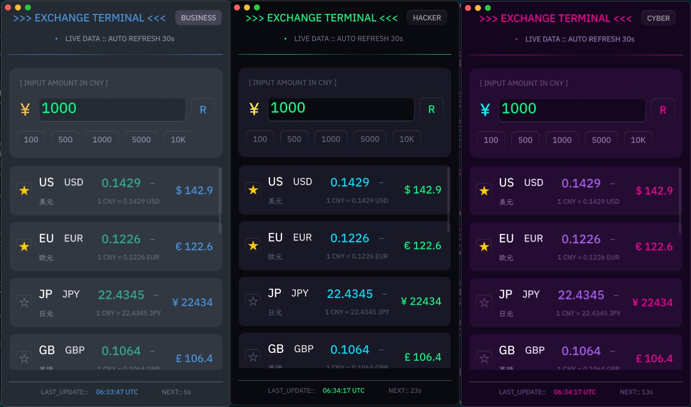
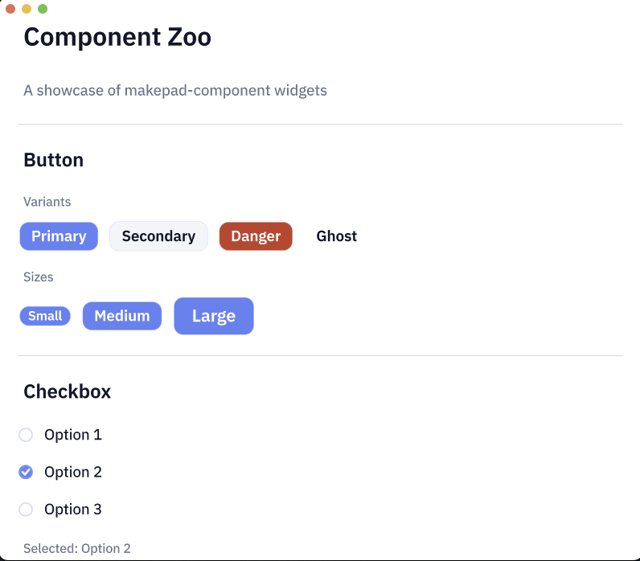
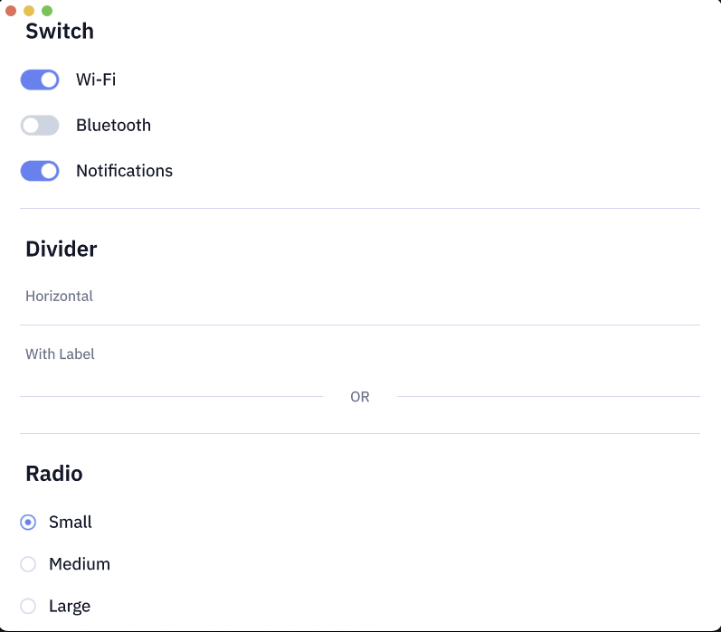
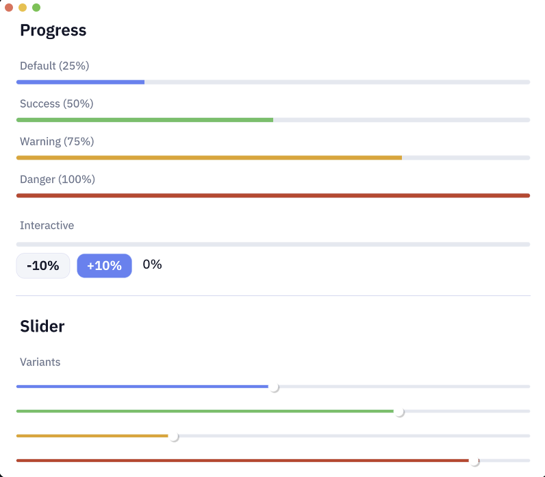
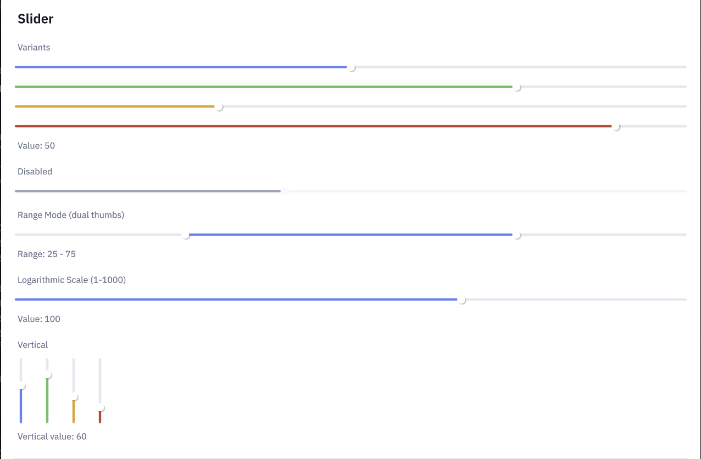

# Makepad 向け Claude Skills

[English](./README.md) | [中文](./README.zh-CN.md) | [日本語](./README.ja.md)

[](./skills/.claude-plugin/plugin.json)
[](./LICENSE)

Rust の [Makepad](https://github.com/makepad/makepad) フレームワークを使用してクロスプラットフォーム UI アプリケーションを構築するための Agent Skills です。

## Makepad について

[Makepad](https://github.com/makepad/makepad) は、Rust で書かれた次世代 UI フレームワークで、高性能なクロスプラットフォームアプリケーションの構築を可能にします。主な特徴：

- **クロスプラットフォーム**：単一のコードベースでデスクトップ（macOS、Windows、Linux）、モバイル（Android、iOS）、Web（WebAssembly）に対応
- **GPU アクセラレーション**：SDF（Signed Distance Field）描画によるカスタムシェーダーベースのレンダリング
- **ライブデザイン**：ホットリロード可能な `live_design!` DSL による迅速な UI 開発
- **高パフォーマンス**：ネイティブコンパイル、仮想 DOM なし、最小限のランタイムオーバーヘッド

## Robius について

[Project Robius](https://github.com/project-robius) は、Rust でフル機能のアプリケーション開発フレームワークを構築するオープンソースイニシアチブです。Makepad で構築された本番アプリケーション：

- **[Robrix](https://github.com/project-robius/robrix)** - リアルタイムメッセージング、E2E 暗号化、複雑な UI パターンを実装した Matrix チャットクライアント
- **[Moly](https://github.com/moxin-org/moly)** - データ集約型インターフェースと非同期操作を実装した AI モデルマネージャー

これらの Skills は Robrix と Moly で使用されているパターンから抽出されています。

## インストール

### プラグインマーケットプレイス（推奨）

Claude Code のプラグインマーケットプレイス経由でインストール：

```bash
# ステップ 1：マーケットプレイスを追加
/plugin marketplace add ZhangHanDong/makepad-skills

# ステップ 2：プラグインをインストール（1つまたは複数選択）
/plugin install makepad-full@makepad-skills-marketplace        # 全スキル
/plugin install makepad-core@makepad-skills-marketplace        # コア + 入門
/plugin install makepad-graphics@makepad-skills-marketplace    # グラフィックス & シェーダー
/plugin install makepad-patterns@makepad-skills-marketplace    # プロダクションパターン
/plugin install makepad-deployment@makepad-skills-marketplace  # プラットフォームパッケージング
/plugin install makepad-reference@makepad-skills-marketplace   # API ドキュメント & トラブルシューティング
```

**利用可能なプラグイン：**

| プラグイン | 説明 |
|-----------|------|
| `makepad-full` | 全スキルを含む完全パッケージ |
| `makepad-core` | 入門、レイアウト、ウィジェット、イベント |
| `makepad-graphics` | SDF 描画、シェーダー、アニメーション |
| `makepad-patterns` | 非同期、ステートマシン、オーバーレイ、リスト |
| `makepad-deployment` | Android、iOS、WASM パッケージング |
| `makepad-reference` | API ドキュメント、トラブルシューティング、コード品質 |
| `makepad-evolution` | 自己進化テンプレートとフック |

### スクリプトインストール

インストールスクリプトでワンコマンドセットアップ：

```bash
# 現在のプロジェクトにインストール
curl -fsSL https://raw.githubusercontent.com/ZhangHanDong/makepad-skills/main/install.sh | bash

# hooks を有効にしてインストール
curl -fsSL https://raw.githubusercontent.com/ZhangHanDong/makepad-skills/main/install.sh | bash -s -- --with-hooks

# 特定のプロジェクトにインストール
curl -fsSL https://raw.githubusercontent.com/ZhangHanDong/makepad-skills/main/install.sh | bash -s -- --target /path/to/project

# Codex 向けにインストール（.codex/skills）
curl -fsSL https://raw.githubusercontent.com/ZhangHanDong/makepad-skills/main/install.sh | bash -s -- --agent codex

# Gemini CLI 向けにインストール（.gemini/skills）
curl -fsSL https://raw.githubusercontent.com/ZhangHanDong/makepad-skills/main/install.sh | bash -s -- --agent gemini
```

Gemini CLI 補足: Skills は実験的機能です。必要に応じて `/settings` で `experimental.skills` を有効化してください。

**スクリプト機能：**
- Rust/Makepad プロジェクトを自動検出（Cargo.toml をチェック）
- インストール前に既存の skills をバックアップ
- `--with-hooks` で自己進化フックをコピーして設定（Claude Code のみ）
- `--agent codex|claude-code|gemini` で Codex、Claude Code、または Gemini CLI を選択（デフォルト: claude-code）
- `--target` で任意のプロジェクトディレクトリにインストール可能
- カラー出力で進捗を明確に表示

**利用可能なオプション：**

| オプション | 説明 |
|-----------|------|
| `--target DIR` | 特定のディレクトリにインストール（デフォルト：現在のディレクトリ） |
| `--with-hooks` | 自己進化フックを有効化（Claude Code のみ） |
| `--agent AGENT` | エージェント指定: `codex`、`claude-code`、または `gemini`（デフォルト: `claude-code`） |
| `--branch NAME` | 特定のブランチを使用（デフォルト：main） |
| `--help` | ヘルプメッセージを表示 |

### 手動インストール

```bash
# このリポジトリをクローン
git clone https://github.com/ZhangHanDong/makepad-skills.git

# プロジェクトにコピー（https://code.claude.com/docs/en/skills）
cp -r makepad-skills/skills your-project/.claude/skills

# Codex プロジェクトにコピー（https://developers.openai.com/codex/skills）
cp -r makepad-skills/skills your-project/.codex/skills

# Gemini CLI プロジェクトにコピー（https://geminicli.com/docs/cli/skills/）
cp -r makepad-skills/skills your-project/.gemini/skills
```

インストール後のプロジェクト構造（Codex/Gemini は `.claude` を `.codex`/`.gemini` に置き換えてください）：

```
your-project/
├── .claude/
│   └── skills/
│       ├── .claude-plugin/
│       │   └── plugin.json
│       ├── 00-getting-started/
│       ├── 01-core/
│       ├── 02-components/
│       ├── 03-graphics/
│       │   ├── _base/          # 公式 skills（アトミック）
│       │   └── community/      # コミュニティ貢献
│       ├── 04-patterns/
│       │   ├── _base/          # 公式 patterns（アトミック）
│       │   └── community/      # コミュニティ貢献
│       ├── 05-deployment/
│       ├── 06-reference/
│       ├── 99-evolution/
│       │   └── templates/      # 貢献テンプレート
│       └── CONTRIBUTING.md
├── src/
└── Cargo.toml
```

詳細は [Claude Code Skills 公式ドキュメント](https://docs.anthropic.com/en/docs/claude-code/skills) を参照してください。

## アーキテクチャ：コラボレーション向けアトミック Skills

### なぜアトミック構造？

v2.1 では、協調開発向けに設計された**アトミック skill 構造**を導入しました：

```
04-patterns/
├── SKILL.md              # インデックスファイル
├── _base/                # 公式 patterns（番号付き、アトミック）
│   ├── 01-widget-extension.md
│   ├── 02-modal-overlay.md
│   ├── ...
│   └── 14-callout-tooltip.md
└── community/            # あなたの貢献
    ├── README.md
    └── {GitHub ユーザー名}-{パターン名}.md
```

**メリット：**
- **マージ競合なし**：`community/` のファイルは公式 `_base/` の更新と競合しません
- **並列開発**：複数のユーザーが同時に貢献可能
- **明確な帰属**：ファイル名の GitHub ユーザー名がクレジットを提供
- **段階的開示**：SKILL.md インデックス → 個別パターンの詳細

### 自己進化：開発から Skills を蓄積

自己進化機能により、開発中に発見したパターンをキャプチャして skills に追加できます。

#### 仕組み

1. **開発中**：Makepad でアプリを構築する際に、有用なパターン、シェーダー、エラー解決策を発見

2. **パターンをキャプチャ**：Claude に保存を依頼：
   ```
   ユーザー: このツールチップ配置ロジックは便利です。コミュニティパターンとして保存して
   Claude: [テンプレートを使用して community/{ユーザー名}-tooltip-positioning.md を作成]
   ```

3. **自動検出**（hooks 有効時）：エラーを遭遇して修正すると、システムが自動的に解決策を troubleshooting にキャプチャ

#### 自己進化フックを有効にする（オプション）

```bash
# 99-evolution からプロジェクトに hooks をコピー
cp -r your-project/.claude/skills/99-evolution/hooks your-project/.claude/skills/hooks

# フックに実行権限を付与
chmod +x your-project/.claude/skills/hooks/*.sh

# フック設定を .claude/settings.json に追加
# skills/99-evolution/hooks/settings.example.json を参照
```

#### 手動パターン作成

Claude に直接依頼：
```
ユーザー: さっき実装したドラッグ&ドロップ並べ替えをコミュニティパターンとして保存して
Claude: テンプレートを使用して作成します...
```

Claude は：
1. `99-evolution/templates/pattern-template.md` テンプレートを使用
2. `04-patterns/community/{あなたのユーザー名}-drag-drop-reorder.md` にファイルを作成
3. frontmatter とコンテンツを入力

### コミュニティ貢献ガイド

#### パターンの貢献

1. **パターンファイルを作成**：
   ```
   04-patterns/community/{GitHub ユーザー名}-{パターン名}.md
   ```

2. **テンプレートを使用**：`99-evolution/templates/pattern-template.md` からコピー

3. **必須の frontmatter**：
   ```yaml
   ---
   name: my-pattern-name
   author: your-github-handle
   source: project-where-you-discovered-this
   date: 2024-01-15
   tags: [tag1, tag2, tag3]
   level: beginner|intermediate|advanced
   ---
   ```

4. **メインリポジトリに PR を送信**

#### シェーダー/エフェクトの貢献

1. **エフェクトファイルを作成**：
   ```
   03-graphics/community/{GitHub ユーザー名}-{エフェクト名}.md
   ```

2. **テンプレートを使用**：`99-evolution/templates/shader-template.md` からコピー

#### エラー解決策の貢献

1. **troubleshooting エントリを作成**：
   ```
   06-reference/troubleshooting/{エラー名}.md
   ```

2. **テンプレートを使用**：`99-evolution/templates/troubleshooting-template.md` からコピー

#### アップストリームとの同期

ローカル skills を更新しながら、貢献を保持：

```bash
# リポジトリをフォークしている場合
git fetch upstream
git merge upstream/main --no-edit
# community/ ファイルは _base/ の変更と競合しません
```

#### 昇格パス

高品質なコミュニティ貢献は `_base/` に昇格される可能性があります：
- パターンが広く有用で十分にテストされている
- ドキュメントが完全
- コミュニティのフィードバックがポジティブ
- `author` フィールドでクレジットを保持

## Skills 一覧 (v2.1 アトミック構造)

### [00-getting-started](./skills/00-getting-started/SKILL.md) - プロジェクトセットアップ

| ファイル | 説明 | 使用場面 |
|----------|------|----------|
| [init.md](./skills/00-getting-started/init.md) | プロジェクトスキャフォールディング | 「新しい Makepad アプリを作成」 |
| [project-structure.md](./skills/00-getting-started/project-structure.md) | ディレクトリ構成 | 「プロジェクトをどう整理すべき？」 |

### [01-core](./skills/01-core/SKILL.md) - コア開発

| ファイル | 説明 | 使用場面 |
|----------|------|----------|
| [layout.md](./skills/01-core/layout.md) | フロー、サイズ、間隔、配置 | 「UI 要素を配置」 |
| [widgets.md](./skills/01-core/widgets.md) | 一般的なウィジェット、カスタムウィジェット | 「ボタンの作り方は？」 |
| [events.md](./skills/01-core/events.md) | イベント処理、ヒットテスト | 「クリックイベントの処理」 |
| [styling.md](./skills/01-core/styling.md) | フォント、テキストスタイル、SVG アイコン | 「フォントサイズを変更」「アイコンを追加」 |

### [02-components](./skills/02-components/SKILL.md) - ウィジェットギャラリー

全ビルトインウィジェット参照（ui_zoo から）：Button、TextInput、Slider、Checkbox、Label、Image、ScrollView、PortalList、PageFlip など。

### [03-graphics](./skills/03-graphics/SKILL.md) - グラフィックスとアニメーション（アトミック）

`_base/` に 14 個の独立 skills：

| カテゴリ | Skills |
|----------|--------|
| シェーダー基礎 | `01-shader-structure`, `02-shader-math` |
| SDF 描画 | `03-sdf-shapes`, `04-sdf-drawing`, `05-progress-track` |
| アニメーション | `06-animator-basics`, `07-easing-functions`, `08-keyframe-animation`, `09-loading-spinner` |
| ビジュアルエフェクト | `10-hover-effect`, `11-gradient-effects`, `12-shadow-glow`, `13-disabled-state`, `14-toggle-checkbox` |

`community/` にはカスタムエフェクトを追加。

### [04-patterns](./skills/04-patterns/SKILL.md) - プロダクションパターン（アトミック）

`_base/` に 14 個の独立 patterns：

| カテゴリ | Patterns |
|----------|----------|
| ウィジェットパターン | `01-widget-extension`, `02-modal-overlay`, `03-collapsible`, `04-list-template`, `05-lru-view-cache`, `06-global-registry`, `07-radio-navigation` |
| データパターン | `08-async-loading`, `09-streaming-results`, `10-state-machine`, `11-theme-switching`, `12-local-persistence` |
| 高度なパターン | `13-tokio-integration`, `14-callout-tooltip` |

`community/` にはカスタムパターンを追加。

### [05-deployment](./skills/05-deployment/SKILL.md) - ビルドとパッケージ

デスクトップ（Linux、Windows、macOS）、モバイル（Android、iOS）、Web（WebAssembly）向けにビルド。

### [06-reference](./skills/06-reference/SKILL.md) - リファレンス

| ファイル | 説明 | 使用場面 |
|----------|------|----------|
| [troubleshooting.md](./skills/06-reference/troubleshooting.md) | よくあるエラーと修正 | 「Apply error: no matching field」 |
| [code-quality.md](./skills/06-reference/code-quality.md) | Makepad 対応のリファクタリング | 「このコードを簡略化」 |
| [adaptive-layout.md](./skills/06-reference/adaptive-layout.md) | デスクトップ/モバイルレスポンシブ | 「デスクトップとモバイル両方に対応」 |

### [99-evolution](./skills/99-evolution/SKILL.md) - 自己改善

| コンポーネント | 説明 |
|---------------|------|
| `templates/` | パターン、シェーダー、troubleshooting テンプレート |
| `hooks/` | 自動検出と検証フック |

## 使用例

### 新規プロジェクト作成
```
ユーザー: カウンターボタン付きの "my-app" という Makepad アプリを作成
Claude: [00-getting-started でプロジェクト作成、01-core でボタン/カウンター実装]
```

### ツールチップを追加
```
ユーザー: ホバー時にユーザー情報を表示するツールチップを追加
Claude: [04-patterns/_base/14-callout-tooltip.md で完全な実装を取得]
```

### カスタムパターンを保存
```
ユーザー: この無限スクロール実装をコミュニティパターンとして保存
Claude: [04-patterns/community/yourhandle-infinite-scroll.md を作成]
```

### コンパイルエラー修正
```
ユーザー: "no matching field: font" エラーが発生
Claude: [06-reference/troubleshooting.md で正しい text_style 構文を特定]
```

## 構築できるもの

これらの Skills を使用すると、Claude は以下をサポートします：

- 適切な構造で新しい Makepad プロジェクトを初期化
- `live_design!` DSL でカスタムウィジェットを作成
- イベントとユーザーインタラクションを処理
- 視覚効果用の GPU シェーダーを作成
- スムーズなアニメーションを実装
- async/tokio でアプリケーション状態を管理
- レスポンシブなデスクトップ/モバイルレイアウトを構築
- すべてのプラットフォーム向けにアプリをパッケージ化
- 開発中に発見したパターンを**キャプチャして共有**

## これらの Skills で構築されたプロジェクト

makepad-skills と Claude Code を使用して作成された実際のプロジェクト：

| プロジェクト | 説明 | 所要時間 |
|-------------|------|----------|
| [makepad-skills-demo](https://github.com/ZhangHanDong/makepad-skills-demo) | 為替レート変換アプリのデモ | 約 20 分 |
| [makepad-component](https://github.com/ZhangHanDong/makepad-component) | 再利用可能な Makepad コンポーネントライブラリ | - |

### makepad-skills-demo スクリーンショット

<p align="center">
  
</p>

### makepad-component スクリーンショット

<p align="center">
  
  
</p>
<p align="center">
  
  
</p>

## リソース

- [Makepad リポジトリ](https://github.com/makepad/makepad)
- [Makepad サンプル](https://github.com/makepad/makepad/tree/main/examples)
- [Project Robius](https://github.com/project-robius)
- [Robrix](https://github.com/project-robius/robrix)
- [Moly](https://github.com/moxin-org/moly)

## ライセンス

MIT
